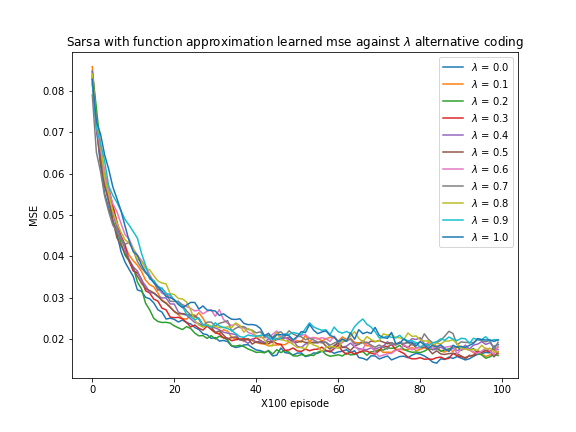

# Reinforcement Learning Playing Easy21
solutions to [David Silver's RL course project Easy21](http://www0.cs.ucl.ac.uk/staff/D.Silver/web/Teaching.html)

## Easy21

#### Easy21 is a variance of classic Blackjack. Specifically, the rules are:

• The game is played with an infinite deck of cards (i.e. cards are sampled with replacement)

• Each draw from the deck results in a value between 1 and 10 (uniformly distributed) with a colour of red (probability 1/3) or black (probability 2/3).

• There are no aces or picture (face) cards in this game

• At the start of the game both the player and the dealer draw one black card (fully observed)

• Each turn the player may either stick or hit

• If the player hits then she draws another card from the deck

• If the player sticks she receives no further cards

• The values of the player’s cards are added (black cards) or subtracted (red cards)

• If the player’s sum exceeds 21, or becomes less than 1, then she \goes bust" and loses the game (reward -1)

• If the player sticks then the dealer starts taking turns. The dealer always sticks on any sum of 17 or
greater, and hits otherwise. If the dealer goes bust, then the player wins; otherwise, the outcome - 
win (reward +1), lose (reward -1), or draw (reward 0) - is the player with the largest sum.

## Reinforcement Learning

A series of on-policy reinforcement learning algorithm was implemented.

#### Monte-Carlo Control 

Monte-Carlo Control with $\epsilon$-greedy exploration strategy  
$\epsilon_t = N_0 / (N_0 + N(S, t)) $ with $N_0 = 100$  
learning rate is $1/N(S, a)$

#### TD Learning

Sarsa($\lambda$) is implemented. $\lambda$ is chosen from {0, 0.1, 0.2, ..., 1}    
Using Value function of Monte-Carlo learning as groundtruth calculate MSE between learned value function and groudtruth  

#### Linear Function Approximation

Consider a simple value function approximator using coarse coding. Use
a binary feature vector φ(s; a) with 3 ∗ 6 ∗ 2 = 36 features. Each binary feature
has a value of 1 iff (s; a) lies within the cuboid of state-space corresponding to
that feature, and the action corresponding to that feature. The cuboids have
the following overlapping intervals:

dealer(s) = {[1; 4]; [4; 7]; [7; 10]}  
player(s) = {[1; 6]; [4; 9]; [7; 12]; [10; 15]; [13; 18]; [16; 21]}  
a = {hit; stick}

where  
• dealer(s) is the value of the dealer’s first card (1-10)
• sum(s) is the sum of the player’s cards (1-21)

Repeat the Sarsa(λ) experiment from the previous section, but using linear
value function approximation $Q(s; a) = φ(s; a)^\topθ$. Use a constant exploration
of $\epsilon = 0.05$ and a constant step-size of 0.01.

## Writeup

#### What are the pros and cons of bootstrap?

Bootstrap makes the algorithm learn faster. But at the same time it becomes hard to converge to the optimal policy.

#### Would you expect bootstrapping to help more in blackjack or Easy21?

Because the length of Easy21 is longer. Bootstrap is likely to help more in Easy21.

#### What are the pros and cons of function approximation in Easy21?

Function approximation can make the algorithm learn faster. Again, we lose some more accuracy in the final value we estimate using the function. 

#### How would you modify the function approximator suggested in this section to get better results in Easy21?

Using a non-overlapping coding scheme to encode the state can provide more stable results.

 

